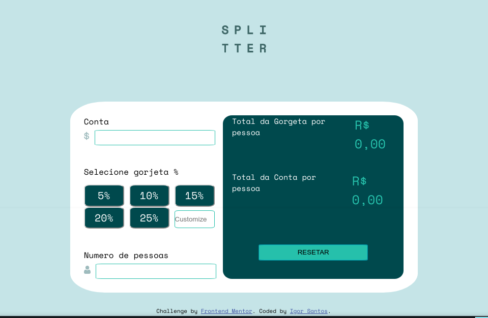

# Frontend Mentor - Calculadora de gorjeta
Desafio do site Frontend Mentor: https://www.frontendmentor.io/solutions

  
## Desafio

- Layout Responsivo
- Hover nos botões
- Calcular a gorjeta e o valor da conta por pessoa
  
## Feito com:

- HTML5
- CSS3
- Flexbox
- Javascript

  
## Conhecimentos obtidos

- Através desse projeto pude praticar minhas habilidades no HTML usando as chamadas tags semânticas
- No CSS usei as variaveis para armazenar as cores, além disso pude praticar mais Flexbox 
- Pude treinar também minhas noções de responsividade

  
## Melhorias Futuras 

- Construir o design de outros tamanhos de telas
- Construir o tratamento de erros de outros cenários que não foram pedidos no desafio

